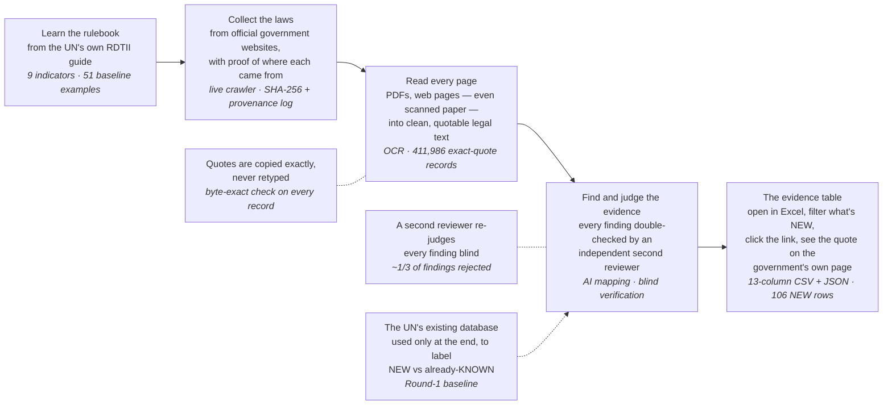

# Workflow — how a law becomes a verified evidence row

Two views of the same pipeline: a high-level map, then a stage-by-stage
detail. Both render inline on GitHub. Every label is a measured fact from the
current corpus (v2.4 + segmentation fix): 2,673 documents, 411,986
byte-exact grounded provision records, 106 NEW evidence rows.

The architecture is the honesty mechanism: four independent stages wired only
by frozen hand-off files, so no stage can quietly grade its own work. The
host's Round-1 baseline database is touched only at the very end, to label
each row NEW vs already-KNOWN — the judging steps never see it.

## High-level

## Stage-by-stage

```mermaid
flowchart LR
  subgraph S0G["STEP 0 — Learn the rulebook"]
    direction LR
    A1["Read the UN's guide<br/>and methodology<br/><i>RDTII 2.1 guide, triple-checked</i>"] --> A2["Freeze it as a codebook<br/>so nothing drifts later<br/><i>indicators.yaml · 51 gold rows</i>"]
  end
  subgraph S1G["STEP 1 — Collect the laws"]
    direction LR
    B1["List every law on<br/>each official site<br/><i>3 portal adapters: SG · MY · AU</i>"] --> B2["Download politely,<br/>one at a time<br/><i>1 request / 3 s, named contact</i>"]
    B2 --> B3["Keep proof of origin<br/>for every file<br/><i>SHA-256 + headers sidecar</i>"] --> B4["Write the catalogue<br/><i>2,673 documents, schema-checked</i>"]
  end
  subgraph S2G["STEP 2 — Read every page"]
    direction LR
    C1["Sort by type:<br/>web page · clean PDF ·<br/>scanned paper<br/><i>402 · 2,228 · 43</i>"] --> C2["Scanned pages are<br/>read by OCR<br/><i>Tesseract + Malay pack · 0.00%/0.93% error on test pages</i>"]
    C2 --> C3["Freeze the text,<br/>cut into numbered sections<br/><i>byte offsets, schedules included</i>"] --> C4["Check every quote<br/>letter-for-letter<br/><i>no quote = no record · 411,986 records</i>"]
  end
  subgraph S3G["STEP 3 — Find and judge the evidence"]
    direction LR
    D1["Search the whole corpus<br/>for each UN question<br/><i>keyword + meaning search</i>"] --> D2["Quick first read<br/>by a fast reviewer<br/><i>Claude Haiku, lenient</i>"]
    D2 --> D3["Careful legal reading,<br/>trap questions answered first<br/><i>Claude Sonnet · 5 trap checks</i>"] --> D4["Blind second opinion;<br/>a third breaks ties<br/><i>~1/3 of findings rejected</i>"]
    D4 --> D5["Score each country;<br/>label NEW vs KNOWN<br/><i>vs the UN's Round-1 baseline</i>"] --> D6["Write the final table;<br/>grade ourselves honestly<br/><i>13-col CSV + JSON · misses disclosed</i>"]
  end
  BL2["The UN's existing database<br/><i>enters here only — the judging<br/>steps never see it</i>"]
  CO["Every dollar is logged,<br/>not estimated<br/><i>$177.52 + $281.59, ledger-exact</i>"]
  S0G --> S1G --> S2G --> S3G
  BL2 -.-> D5
  CO -.- S3G
```

See [DATA.md](DATA.md) for what each run mode needs, [DISCLOSURES.md](DISCLOSURES.md)
for the honest-gaps ledger, and the repository README for the full architecture
and the one-command Quick Start.
