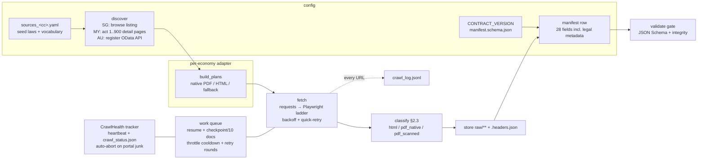

# rdtii-p1-scrape — Project 1: Web Scraping / Retrieval

Stage 1 of the RDTII pipeline. Crawls the **live** official legal portals of Singapore,
Malaysia and Australia, retrieves the **complete, pillar-agnostic statute corpus** as raw
bytes (native PDF, scanned PDF, HTML) with full HTTP provenance and legal metadata, and
emits **Hand-off #1**. It does **no** OCR, cleaning, tagging, or mapping — those are
Projects 2 & 3.

## The corpus this code produced (v2.4, 2026-07-18)

| Economy | Portals | Laws | native PDF | scanned PDF | HTML | Metadata captured |
|---|---|--:|--:|--:|--:|---|
| SG | sso.agc.gov.sg + PDPC/MAS/CSA | 536 | 535 | 1 | — | title, status |
| MY | lom.agc.gov.my + PDP/NACSA/SC | 869 | 825 | 42 | 2 | title, publication/assent/commencement dates |
| AU | legislation.gov.au + APRA/OAIC | 1,268 | 868 | — | 400 | title, assent date, in-force status |
| **Total (current versions)** | | **2,673** | 2,228 | 43 | 402 | |

`validate` result: **2,706 rows (2,673 current + 33 superseded), 0 errors, 0 warnings**
(contract **0.2.0**). ~1.85 GB raw. The 33 superseded rows are the AU multi-volume
truncation fix (2026-07-17, corpus v2.4 — see `docs/CORPUS_VERSIONS.md` and report
Addendum 5): complete `-002` re-issues supersede volume-1-only `-001` captures, both
rows kept for provenance.
**Version currency:** every document is the portal's most current form — SG current
consolidations, MY current consolidated English versions (`/EN/`, 609 acts) or newest
reprints, AU latest compilations. **Beyond acts**, the corpus carries the
subsidiary/regulator layer: SG subsidiary legislation + PDPC/MAS/CSA instruments,
MY PDP guidelines/regulations + Act 854 P.U.(A) regs + SC guidelines, AU F-series
legislative instruments + APRA prudential standards + OAIC registered codes
(2026-07-14 delta + 2026-07-15 discovery sweep). The corpus itself is **not in git**
(size); regenerate with one command (below).

---

## Workflow map



Detailed per-country recipes and every problem we hit (and the fix) are in
[docs/WORKFLOW.md](docs/WORKFLOW.md).

---

## Quick Start (Windows, CPU-only)

Python is **not** reliably on PATH on Windows (the MS Store stub is not a real Python),
so install a real interpreter and always call it by its venv path.

```powershell
# 1. Install a real Python 3.12 (once). Then disable the MS Store aliases:
#    Settings > Apps > Advanced app settings > App execution aliases > turn OFF python.exe / python3.exe
winget install --id Python.Python.3.12 --scope user

# 2. Create the venv + install pinned deps + the Chromium browser
py -3 -m venv .venv
.\.venv\Scripts\python -m pip install -r requirements.txt
.\.venv\Scripts\python -m playwright install chromium

# 3. Smoke test — deterministic seed slice (a few laws per economy, ~5 min)
.\.venv\Scripts\python scrape.py --economy SG,MY,AU --seed-laws-only --out handoff1

# 4. THE main event — the complete 3-economy corpus (~6-8 h, resumable, safe to interrupt)
.\.venv\Scripts\python scrape.py --economy SG,MY,AU --scope all --out handoff1

# 5. Validate the hand-off against the frozen schema
.\.venv\Scripts\python scrape.py --validate handoff1\manifest.csv
```

**Resume semantics:** re-running step 4 skips every law already retrieved (by the
`.idmap.json` registry) and continues where it stopped — after a crash, a throttle
abort, or a Ctrl-C. The manifest checkpoints every 10 documents, so nothing is lost.

**Watch a running crawl:** the crawler self-reports (`[health]` heartbeat +
`handoff1/crawl_status.json`). From another terminal:

```powershell
.\.venv\Scripts\python tools\crawl_tracker.py --out handoff1
# exit 0 = watch window over; exit 2 = STALL detected; exit 3 = THROTTLE suspected
```

---

## CLI

```
python scrape.py --economy SG,MY,AU --scope all           # complete corpus (the deliverable)
python scrape.py --economy Singapore --seed-laws-only     # deterministic demo slice
python scrape.py --all --pillars 6,7 --scope relevant     # seed ∪ vocabulary-matched subset
python scrape.py --smoke                                  # 3-portal live-fetch evidence
python scrape.py --validate handoff1/manifest.csv         # schema + integrity gate
```

`--economy` accepts `SG|AU|MY` or full names, comma-separated, or `all`. `--scope`
∈ `seed | relevant | all`. `--forms` ∈ `pdf | html | both` (defaults: `pdf` for
`--scope all`, `both` otherwise). Unknown countries exit non-zero cleanly.

---

## Output contract (Hand-off #1)

`contracts/schemas/manifest.schema.json` (**28 fields, 15 required**, Draft 2020-12) is
the single source of truth; `validate` is the gate. Contract version: **0.2.0**
(v0.2.0 added the legal-metadata fields `publication_date`, `assent_date`,
`commencement_date`, `in_force_status`).

Key rules: `local_path`/`http_headers_path` are **relative** (no absolute paths);
`pdf_is_scanned` is present in every row and `null` only when `source_type=html`;
`content_sha256` unique per file; `doc_id` (`<cc>-<lawslug>-<seq>`) stable across re-runs.

```
handoff1/
  manifest.csv          # one row per document, frozen column order
  manifest.jsonl        # same rows + nested http {status, redirect_chain, headers}
  crawl_log.jsonl       # EVERY url touched (incl. failures) — the live-crawl audit trail
  cost_report.json      # bytes/docs/requests counters
  crawl_status.json     # live heartbeat while a crawl runs
  inventory_<cc>.csv    # curated seed inventory (the COMPLETE retrieval record is manifest.jsonl)
  raw/<CC>/<law_slug>/<ts>__<kind>.<ext>              # kind ∈ {native, scanned, page}
                      /<ts>__<kind>.<ext>.headers.json  # provenance sidecar
```

---

## Repo layout

```
scrape.py                 # friendly CLI wrapper
src/p1_scrape/
  orchestrator.py         # work queue: resume, checkpoints, throttle cooldown, CrawlHealth
  fetcher.py              # requests→Playwright ladder, backoff, PDF quick-retry, iframe capture
  classifier.py           # §2.3 html/pdf_native/pdf_scanned (pypdfium2 chars/page; never raises)
  manifest.py / schema.py # writers + the validate gate
  dedup.py                # URL normalize + sha256 + stable doc_id (.idmap.json)
  adapters/
    sg_sso.py             # SG: browse listing ∪ ASC/DESC; ?ViewType=Pdf fast path
    my_gazette.py         # MY: lom act-by-number; prefers /EN/ current consolidation; title+dates
    au_legislation.py     # AU: OData enumeration; dated PDF endpoint; epubFrame HTML fallback
tools/crawl_tracker.py    # external stall/throttle watchdog
contracts/                # pinned schema + per-economy source registries
instrument/               # working copies of sources_<cc>.yaml
tests/                    # 20 tests (schema round-trip, classifier, MY version-currency, regressions)
```

---

## Ethics / robots stance

We fetch **public-record statute pages** a citizen may read in a browser, one document at
a time, at a low polite rate (default 1 req / 3 s per host, jittered), with an
**identifiable User-Agent** carrying a contact string. `robots.txt` is treated as advisory
scope guidance for discovery paths (`RESPECT_ROBOTS_FOR_DISCOVERY=true`), not a hard block
on public canonical statute URLs (`ROBOTS_HARD_BLOCK=false`). When a portal signals
overload (SSO's HTTP 467/202 anti-bot), the crawler backs off exponentially and the health
monitor **stops the economy early** rather than hammering it — the crawl resumes later.

---

## Provenance & license

License: **Apache-2.0** (see `LICENSE`).

The Singapore/Australia portal-access layer is built on the foundation of the **author's
own prior web-scraping work** (Jiaxiang (John) Chen, 2025). It is **evolved, not vendored
verbatim**: the transport recipes that are publicly-observable portal facts (SSO
`?ViewType=Pdf`; legislation.gov.au `/latest/text` + `iframe#epubFrame`) were reimplemented
cleanly inside `src/p1_scrape/adapters/`, with hardcoded local paths removed and full
contract-compliant provenance capture added. No third-party or restricted code is included.

---

## Troubleshooting

- **`python` opens the Microsoft Store** — that's the Store stub; install real Python 3.12
  and disable the app-execution aliases; always call `.\.venv\Scripts\python`.
- **Playwright browser missing** — `.\.venv\Scripts\python -m playwright install chromium`.
- **SG returns HTTP 202 / HTML instead of PDF** — SSO's anti-bot. The fetcher quick-retries
  (4s/8s/12s); if it persists the health monitor aborts SG with a clear message. Wait an
  hour and re-run — resume continues from where it stopped.
- **Crawl seems silent for ~20 min at the start of MY / AU** — that's the inventory
  harvest (MY: 900 detail pages; AU: API enumeration + downloads-page resolution). The
  `[health]` heartbeat and `crawl_status.json` still update.
- **A portal is down at judging time** — `.headers.json` sidecars prove each document
  resolved at retrieval time; failures are still logged in `crawl_log.jsonl`.
