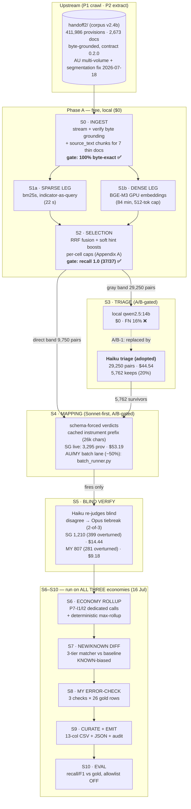

# RDTII P3 — Workflow map

Visual map of the pipeline. Mechanism details with worked examples:
`MAPPING_MECHANISM.md`. Chronological record: `WORKFLOW_LOG.md`.

## Stage cheat-sheet

| Stage | Tool / model | Input → output | Gate / rule | Status · cost |
|---|---|---|---|---|
| S0 ingest | Python (stream) | provisions.jsonl → prefilter corpus + indexes | byte-exact grounding; schema sample | ✅ 100% · $0 |
| S1 sparse | bm25s + PyStemmer | corpus × 9 indicator queries → top-50k ranks | recall-first, no early cut | ✅ 22 s · $0 |
| S1 dense | BGE-M3 (GPU) | corpus embeddings → cosine top-50k | 512-token cap; resume-safe | ✅ 84 min · $0 |
| S2 select | Python (RRF) | two rank lists → direct/gray bands | caps per cell; hints boost never remove; organic recall ≥0.95 | ✅ recall 1.0 · $0 |
| S3 triage | **Haiku** (A/B verdict) | gray pairs → keep/drop | lenient screen; errors default keep | ✅ $44.54 |
| S4 mapping | **Sonnet** (A/B verdict) | provision + candidates → schema verdicts | trap booleans before verdicts; quote must ground | ✅ SG live $53.19 · MY batch $23.99 · AU batch+v2.4-delta $84.40 |
| S5 verify | Haiku blind + Opus tiebreak | each fire → agree/upheld/overturned/split | 2-of-3 majority; splits → human | ✅ SG 1,210 (399) $14.44 · MY 807 (281) $9.18 · AU 1,698 (602) $21.16 |
| S6 rollup | Sonnet ×2/econ + deterministic | VERIFIED fires → economy scores | reads verified_*.jsonl directly (audit fix 3); inverted polarity; escalation on distinct verified laws | ✅ SG + MY (both flag a P6-I2 escalation finding) |
| S7 NEW/KNOWN | Python | rows vs baseline → tags | law+section match (plural-stemmed); ties → KNOWN | ✅ SG 428 K / 383 N · MY 37 K / 489 N |
| S8 MY check | Python (+Sonnet substance) | 26 MY gold rows → correct/not | URL, currency, substance | ✅ re-run vs live MY CSV, crossref populated (4 dead baseline URLs); s.10(2) refutation banked |
| S9 emit | Python | verified rows → 13-col CSV + JSON | audit-trio HARD gate; baseline-reproduction guarantee; _ws collapse (URLs exempt); contract-§6 no-provision rows; host JSON fields per law; hold-out safe | ✅ SG 42 / MY 57 / AU 40 rows, 0 violations; URL liveness 92/92 |
| S10 eval | Python | CSV vs gold → recall/F1 | allowlist OFF, EXEMPLAR_PROFILE=eval | ✅ SG recall 0.846 (misses documented) |

Chain order is enforced by `src/p3map/chain.py` (S5→S7→S6→S9→S10 — audit fix 3);
`src/p3map/preflight.py` gates every S4 batch (audit fix 1b).

**Decision points that shaped the map** (all pre-registered, all measured):
A/B-1 local-vs-Haiku triage → FAIL(16% FN) → Haiku · A/B-2 Haiku-vs-Sonnet mapper
→ FAIL(43% grounding) → Sonnet · dense-leg 8192→512 tokens (50× throughput) ·
PREFILTER_FLOOR recalibrated to RRF scale · absence rows out of the recall
denominator except inverted-polarity P7-I1/I2.
